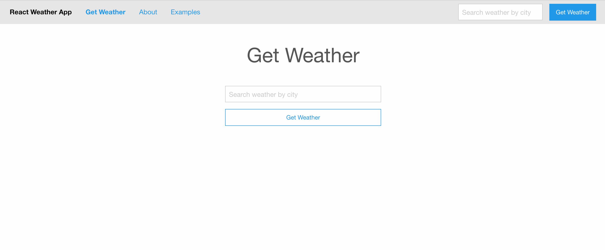

# React Weather App

- Built a single page React Weather web app.

- Used React Router to route between pages.

- Used OpenWeatherMap API to access weather data by city.

## To Start:

- run webpack -w
- npm start to run node server.js
